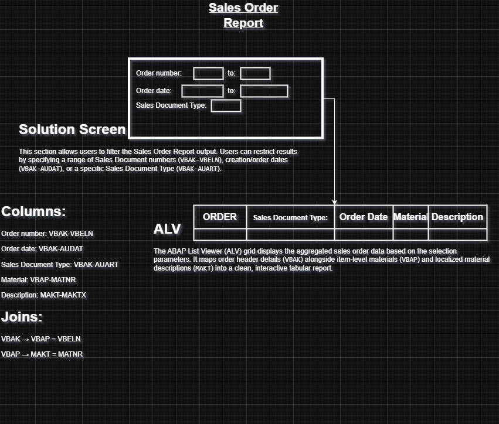

# ABAP Sales Order Report

A simple SAP ABAP report (`ZDBM_ORDERS_REPORTS`) that lets a user filter sales orders by order number, order date, and sales document type, then displays the results — order, sales document type, order date, material, and material description — in an ABAP List Viewer (ALV) grid.



## Overview

The report reads sales order header data from `VBAK`, joins it to the order items in `VBAP`, and left-joins the material description from `MAKT` (in the logon language). Results are rendered with `REUSE_ALV_GRID_DISPLAY` for an interactive, sortable grid.

**Tables used**

| Table  | Purpose                                   |
|--------|--------------------------------------------|
| `VBAK` | Sales order header (order number, type, date) |
| `VBAP` | Sales order items (material)              |
| `MAKT` | Material descriptions (by language)       |

**Joins**

```
VBAK → VBAP  on VBELN
VBAP → MAKT  on MATNR
```

## Selection Screen

The selection screen lets the user filter the report by:

- **Order number** (range) — `VBAK-VBELN`
- **Order date** (range) — `VBAK-AUDAT`
- **Sales Document Type** (single value, optional) — `VBAK-AUART`

If Sales Document Type is left blank, the report returns orders for all document types.


## Report Output (ALV)

Once executed, the report displays the following columns in an ALV grid:

| Column               | Field         |
|-----------------------|--------------|
| Order                  | `VBAK-VBELN` |
| Sales Document Type    | `VBAK-AUART` |
| Order Date             | `VBAK-AUDAT` |
| Material                | `VBAP-MATNR` |
| Description             | `MAKT-MAKTX` |

If no records match the selection criteria, the report displays the message **"No records found"**.


## Design / Diagrams

The `Diagrams` folder contains the design notes used while building the report, mapping each screen field and ALV column to its underlying data element, plus the join logic between `VBAK`, `VBAP`, and `MAKT`.

- [`SOR_Diagram.jpg`](Diagrams/SOR_Diagram.jpg) — clean version of the design (shown above)
- [`SOR_Diagram.drawio`](Diagrams/SOR_Diagram.drawio) — editable draw.io source
- [`Diagram.png`](Diagrams/Diagram.png) — original hand-drawn sketch

## Project Structure

```
ABAP_Sales_Order_Report/
├── Src/
│   └── ZDBM_ORDERS_REPORTS.abap   # Report source code
├── Screenshots/
│   ├── Selection Screen.png       # Selection screen at runtime
│   └── ALV.png                    # ALV grid output
├── Diagrams/
│   ├── SOR_Diagram.jpg            # Design diagram (clean)
│   ├── SOR_Diagram.drawio         # Design diagram (editable source)
│   └── Diagram.png                # Design diagram (hand-drawn sketch)
└── README.md
```

## How to Use

1. Open your SAP system in Eclipse ADT or the SAP GUI (`SE38`/`SE80`).
3. Create a new executable report named `ZDBM_ORDERS_REPORTS` (or any Z-name of your choosing).
4. Copy the code from [`Src/ZDBM_ORDERS_REPORTS.abap`](Src/ZDBM_ORDERS_REPORTS.abap) into the report.
5. Go to "Text Element" in the same menu
6. Fill the data in Text Symbols and Selection Texts from [`Src/Text Element.xlsx`](Src/Text Element.xlsx)
7. Activate the text element separately. 
8. Activate the report.
9. Run it (`F8`), enter optional filters on the selection screen, and execute to view the ALV output.

## Author

Made by **Yousef Waleed**
